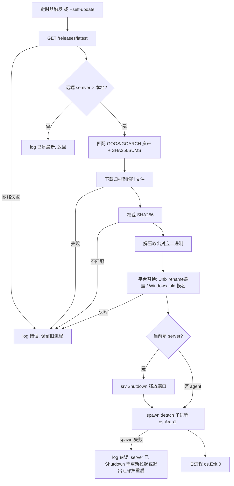

# feat: coding-pet agent/server 自更新（Self-Update）

- **日期**: 2026-07-07
- **类型**: feat
- **范围分级**: Standard
- **origin**: `docs/brainstorms/2026-07-07-self-update-requirements.md`
- **模块路径**: `github.com/simonlei/coding-pet-dashboard`

---

## Summary

让运行中的 `coding-pet-agent` 与 `coding-pet-server` 能自行感知 GitHub 上发布的新正式版，下载对应平台/架构的二进制、校验 SHA256、原子替换自身，并通过「spawn detach 子进程 → 旧进程退出」重启到新版本。触发方式为进程内定时自动检查（默认开启）与 `--self-update` 手动一次性触发，两者复用同一套更新逻辑。三平台（Windows/macOS/Linux）行为一致。

更新逻辑内置于两个二进制自身（新增 `internal/selfupdate` 包），不引入独立 updater、不用双脚本。硬前置：先把两处 `const version` 改为 `var version`，否则 CI 的 `-ldflags -X` 注入无效，版本比较无法工作。

---

## Problem Frame

当前 agent/server 只能靠人工 `restart.sh` 重编译或手动分发二进制升级；多设备部署时逐台更新成本高、易漏（见 origin 问题陈述）。目标：`git tag v* && push` 触发 CI 发布 release 后，所有在线设备在下一个检查周期内各自自动升级，无需登录每台机器。一台设备可能同时运行 agent 与 server，两者各自独立更新、互不干扰。

**关键代码现状（研究确认）：**
- `cmd/agent/main.go:17` 与 `cmd/server/main.go:17` 均为 `const version = "0.1.0"`——`-ldflags -X` 对 const 静默失效。
- agent 无信号处理：`cmd/agent/main.go` 是 `for range ticker.C` 无限循环，无优雅退出。因其无监听端口，可直接 spawn-child-then-exit。
- server 已有优雅关闭：`cmd/server/main.go:46-64` 捕获 SIGINT/SIGTERM 调 `srv.Shutdown(ctx)`，用 `srv.ListenAndServe()`。「关监听→spawn 子进程」可映射为「先 Shutdown 释放端口，再 spawn」。
- 无 `os.Executable()` 使用；无 archive/semver 库；平台分文件约定为 `//go:build !windows` / `//go:build windows`（见 `internal/collector/pidfile_unix.go:1`、`pidfile_windows.go:1`）。
- HTTP 客户端与 `encoding/json` 已在用（`cmd/agent/main.go:99`）。

---

## Requirements Traceability

| R-ID | 需求（origin 成功标准） | 覆盖单元 |
|------|------------------------|----------|
| R1 | 同机 agent+server 各自升级后继续正常工作 | U1, U4, U5, U6 |
| R2 | 三平台完成「下载→校验→替换→重启」全流程 | U2, U3, U4 |
| R3 | 版本比较正确，仅远端更新时才升级（`var version` 修复后） | U1, U2 |
| R4 | `--self-update` 手动与定时自动复用同一逻辑 | U5, U6 |
| R5 | 升级失败安全回退：旧进程继续运行，不留损坏二进制 | U3, U4 |

---

## Key Technical Decisions

- **KTD1 — `const version` → `var version`（硬前置）。** 两处改为 `var version = "dev"`（默认值便于本地识别未注入构建）。这是全特性阻塞项，作为第一个单元完成。（see origin: 硬性前置章节）

- **KTD2 — 轻量 semver 比较，不引第三方库。** 自写解析器解析 `vX.Y.Z`（容忍前导 `v`、可选 `-prerelease` 后缀直接判为「非正式版/跳过」）。**仅当远端严格大于本地才升级**，防止 `latest` 被重新指向旧 tag 时误降级。本地 `version` 若为非 semver（如 `dev`、`dev-abc123`）则视为「总是允许升级到任何正式版」。理由：单机 30min 间隔无需重量级依赖；严格大于比较满足 R3。

- **KTD3 — 数据源为 GitHub REST `/releases/latest`，未认证。** `GET https://api.github.com/repos/simonlei/coding-pet/releases/latest` 只返回最新正式版（自动跳过 prerelease/draft）。**不处理 token**——未认证 60 req/h 对单机 30min 间隔充裕。（see origin: 版本来源章节）

- **KTD4 — 资产选择依 `runtime.GOOS`/`runtime.GOARCH`。** 归档名 `coding-pet-${tag}-${GOOS}-${GOARCH}.tar.gz`（Windows `.zip`）；从 release 的 assets 列表按后缀匹配。SHA256 从同 release 的 `SHA256SUMS.txt` 资产读取并校验。（see origin: 依赖与假设）

- **KTD5 — 二进制名自识别，参数透传 `os.Args[1:]`。** 用 `os.Executable()` 取当前二进制绝对路径；从 basename 判定当前是 agent 还是 server（决定从归档中取哪个二进制）。重启子进程时透传 `os.Args[1:]`——agent/server 的所有 flag 均可重复传入，无一次性/敏感参数（`--server/--token/--id/--interval` 与 `--port/--token` 均幂等）。（解决 origin 待解决问题 4）

- **KTD6 — 平台替换策略分叉（`//go:build` 分文件）。**
  - Unix（`!windows`）：新二进制写临时文件 → `os.Chmod` 可执行 → `os.Rename` 覆盖当前二进制（运行进程持有旧 inode，新文件供下次 exec）。
  - Windows：当前 `.exe` `os.Rename` 成 `<name>.old` → 新 exe 写到原名 → spawn → 旧进程退出 → **下次启动时**清理残留 `.old`（解决 origin 待解决问题 5）。
  （see origin: 平台差异章节）

- **KTD7 — 重启即 spawn detach 子进程后旧进程退出，不自杀。**
  - agent：无监听端口，直接 spawn 子进程后 `return`/`os.Exit(0)`。
  - server：先 `srv.Shutdown(ctx)` 释放端口，再 spawn 子进程 bind 同端口；亚秒级空窗对轮询 dashboard 无感。
  - detach：Unix 用 `setsid`（`SysProcAttr{Setsid: true}`），Windows 用 `DETACHED_PROCESS`（`SysProcAttr{CreationFlags: ...}`）；stdio 重定向到现有日志文件（追加）。（see origin: 更新与重启序列）

- **KTD8 — 默认开启定时自动检查，可关闭。** 默认间隔 **30min + 抖动**（`interval + rand(0..interval/2)`，避免多设备同刻打 API，解决 origin 待解决问题 1）。`--auto-update`（默认 `true`）flag **且** 环境变量 `CODING_PET_AUTO_UPDATE=false` 均可关闭（flag 优先，解决 origin 待解决问题 2）。

- **KTD9 — 更新事件日志走标准 `log`。** 检查/发现新版/下载/校验/替换/重启/失败均 `log.Printf`，落入既有 `logs/*.log`（restart.sh 重定向）。失败路径记录后**保留旧进程继续运行**（解决 origin 待解决问题 6，满足 R5）。

---

## High-Level Technical Design

### 更新流程（agent 与 server 共用 `RunUpdate`）



### 包结构

```text
internal/selfupdate/
├── selfupdate.go        # RunUpdate 编排；CheckAndUpdate；后台定时器 StartAutoUpdate
├── github.go            # /releases/latest 拉取、资产/SHA 选择、下载
├── version.go           # 轻量 semver 解析与比较
├── archive.go           # tar.gz / zip 解压取指定二进制
├── replace_unix.go      # //go:build !windows  原子 rename 覆盖
├── replace_windows.go   # //go:build windows   .old 换名 + 启动清理
├── restart_unix.go      # //go:build !windows  setsid detach spawn
├── restart_windows.go   # //go:build windows   DETACHED_PROCESS spawn
├── version_test.go
├── github_test.go
└── archive_test.go
```

---

## Output Structure

见上方 High-Level Technical Design 的包结构树。新增独立包 `internal/selfupdate/`，agent/server main 仅新增少量接线代码。

---

## Implementation Units

### U1. 修复版本注入并新增 `--version` flag（硬前置）

- **Goal**: 让二进制报告真实注入版本，为后续版本比较打基础。
- **Requirements**: R1, R3
- **Dependencies**: 无（必须第一个完成）
- **Files**:
  - `cmd/agent/main.go`（`const version` → `var version = "dev"`；新增 `--version` flag 打印后退出）
  - `cmd/server/main.go`（同上）
- **Approach**: 两处 `const version = "0.1.0"` 改为 `var version = "dev"`（默认值标识未经 CI 注入的本地构建；CI 的 `-ldflags "-X main.version=..."` 现在能生效）。新增 `--version` bool flag：若为真，`fmt.Println(version)` 后 `os.Exit(0)`，在 `flag.Parse()` 之后、其余逻辑之前。保留两个 main 顶部现有 Swagger/注释不动。
- **Patterns to follow**: 现有 flag 定义风格 `cmd/agent/main.go:20-24`；`.github/workflows/build.yml:70` 的 `-X main.version` 已就绪，无需改 CI。
- **Test scenarios**:
  - Covers R3. 手动/单测：以 `-ldflags "-X main.version=v9.9.9"` 构建后运行 `--version` 输出 `v9.9.9`（验证 var 生效）。
  - 未注入构建运行 `--version` 输出 `dev`。
  - `--version` 打印后进程立即退出、不进入主循环（agent 不要求 `--server`）。
- **Verification**: `go build -ldflags "-X main.version=vTEST"` 后 `./coding-pet-agent --version` 打印 `vTEST`；不带 `--version` 行为不变。

---

### U2. semver 解析与比较（`version.go`）

- **Goal**: 提供「远端是否严格新于本地」的判定。
- **Requirements**: R3
- **Dependencies**: 无（可与 U1 并行，但逻辑上供后续单元使用）
- **Files**:
  - `internal/selfupdate/version.go`
  - `internal/selfupdate/version_test.go`
- **Approach**: 解析 `vX.Y.Z`：去前导 `v`，按 `.` 切三段整数；含 `-`(prerelease) 后缀的远端 tag 视为跳过（不升级到预发布）。核心函数 `IsNewer(remote, local string) (bool, error)`：本地非法/非 semver（如 `dev`、`dev-abc`）时返回 `true`（允许升级到任意正式版）；远端非法返回 error 并由调用方 log 后跳过。严格大于才为 true（相等或更旧为 false）。
- **Patterns to follow**: 标准库 `strconv`、`strings`；无第三方依赖（KTD2）。
- **Test scenarios**:
  - Happy: `IsNewer("v1.2.3","v1.2.2")==true`；`v1.3.0 > v1.2.9`；`v2.0.0 > v1.9.9`。
  - 相等/更旧：`v1.2.3` vs `v1.2.3` → false；`v1.2.2` vs `v1.2.3` → false（防降级，R3）。
  - 本地为 `dev` / `dev-abc123` → 任意正式远端返回 true。
  - 远端带 prerelease 后缀 `v1.2.3-rc1` → 跳过（false 或明确的 skip 语义）。
  - 边界：缺段 `v1.2`、非数字段 `v1.x.0`、空串 → 返回 error，不 panic。
- **Verification**: `go test ./internal/selfupdate/ -run Version` 全绿。

---

### U3. GitHub release 查询、资产选择、下载与校验（`github.go`）

- **Goal**: 拿到最新正式版 tag、正确平台归档 URL 及其 SHA256，下载并校验到临时文件。
- **Requirements**: R2, R5
- **Dependencies**: U2
- **Files**:
  - `internal/selfupdate/github.go`
  - `internal/selfupdate/github_test.go`
- **Approach**: `FetchLatest()` GET `https://api.github.com/repos/simonlei/coding-pet/releases/latest`（`User-Agent` 头必填，否则 GitHub 403），解析 JSON 取 `tag_name` 与 `assets[]`（`name`+`browser_download_url`）。按 `coding-pet-<tag>-<runtime.GOOS>-<runtime.GOARCH>.<tar.gz|zip>` 选归档、找 `SHA256SUMS.txt` 资产。`Download(url, dst)` 流式写临时文件并同时算 SHA256，与 `SHA256SUMS.txt` 中该文件名的期望值比对；不符则删临时文件返回 error（R5 安全回退）。归档扩展名：Windows=`.zip`，其余=`.tar.gz`。
- **Patterns to follow**: `cmd/agent/main.go:99` 的 `http.Client{Timeout}` 风格（下载用更长 timeout）；`encoding/json` 解析同 `internal/server/handler.go:62`。
- **Test scenarios**:
  - Happy: 用 `httptest.Server` 伪造 release JSON + 归档 + SHA 文件，`FetchLatest` 正确解析 tag 与资产；`Download` 校验通过写出临时文件。
  - 资产选择：给定多平台 assets，按当前 GOOS/GOARCH 选中正确项；Windows 选 `.zip`。
  - 错误路径：API 404/网络错误 → 返回 error 不 panic；SHA256 不匹配 → 删临时文件并返回 error（Covers R5）；缺 `SHA256SUMS.txt` → 明确 error。
  - 缺 User-Agent 场景说明（文档/注释即可，实测靠 httptest）。
- **Verification**: `go test ./internal/selfupdate/ -run GitHub` 全绿；校验失败时临时文件被清理。

---

### U4. 平台替换与 detach 重启（`replace_*.go` / `restart_*.go` / `archive.go`）

- **Goal**: 把校验通过的归档解出目标二进制，原子替换当前二进制，并 spawn detach 子进程。
- **Requirements**: R1, R2, R5
- **Dependencies**: U3
- **Files**:
  - `internal/selfupdate/archive.go` + `internal/selfupdate/archive_test.go`
  - `internal/selfupdate/replace_unix.go`（`//go:build !windows`）
  - `internal/selfupdate/replace_windows.go`（`//go:build windows`）
  - `internal/selfupdate/restart_unix.go`（`//go:build !windows`）
  - `internal/selfupdate/restart_windows.go`（`//go:build windows`）
- **Approach**:
  - `archive.go`：依扩展名用 `archive/tar`+`compress/gzip` 或 `archive/zip` 遍历，取出名为 `coding-pet-agent`/`coding-pet-server`(+`.exe`) 的条目写临时文件、置可执行位。目标二进制名由调用方按 `os.Executable()` basename 传入（KTD5）。
  - `replace_unix.go`：`Replace(newTmp, targetPath)` = `os.Chmod`+`os.Rename(newTmp, targetPath)`（同分区原子覆盖）。
  - `replace_windows.go`：`os.Rename(targetPath, targetPath+".old")` → `os.Rename(newTmp, targetPath)`；导出 `CleanupOld(targetPath)` 供启动时删除残留 `.old`（KTD6，best-effort，失败仅 log）。
  - `restart_unix.go`：`Restart(path, args)` 用 `exec.Command` + `SysProcAttr{Setsid:true}`，stdout/stderr 指向追加打开的日志文件，`Start()` 后不 `Wait`。
  - `restart_windows.go`：同形，`SysProcAttr{CreationFlags: windows.DETACHED_PROCESS | CREATE_NEW_PROCESS_GROUP}`。
  - 任一步失败：log 并返回 error，调用方保留旧进程（R5）。Windows 替换失败要尽量把 `.old` 换回原名回滚。
- **Execution note**: 跨平台 spawn/替换难以在 CI 单测充分覆盖——`archive.go` 与 `replace_*` 的纯文件逻辑写单测；`restart_*` 的真实进程行为列入下方手动验证场景。
- **Patterns to follow**: `//go:build` 分文件约定 `internal/collector/pidfile_unix.go:1` / `pidfile_windows.go:1`。
- **Test scenarios**:
  - `archive.go` 单测：构造内存 `.tar.gz` 与 `.zip`，各含 agent+server 两个条目，`Extract` 按名取出正确文件、内容一致、Unix 下可执行位已置。
  - `replace_unix` 单测：临时目录内造「当前二进制」文件，Replace 后内容为新文件、路径不变。
  - `replace_windows` 单测（在 Windows CI/本地）：Replace 后原名为新内容且存在 `.old`；`CleanupOld` 能删除 `.old`。
  - 错误：损坏归档 / 缺目标条目 → error 不 panic（Covers R5）。
  - **手动验证（三平台）**：真实发布一个更高版本 release，运行旧二进制触发更新，确认新进程以新版本起来（`--version`）、旧进程退出、Windows 无残留 `.old`（重启后清理）。
- **Verification**: `go test ./internal/selfupdate/ -run 'Archive|Replace'` 全绿；三平台手动跑通「下载→替换→重启」。

---

### U5. 更新编排 `RunUpdate` / `CheckAndUpdate`（`selfupdate.go`）

- **Goal**: 把 U2–U4 串成一次完整「检查→（有新版则）下载校验替换重启」，供手动与定时共用。
- **Requirements**: R2, R4, R5
- **Dependencies**: U2, U3, U4
- **Files**:
  - `internal/selfupdate/selfupdate.go`
- **Approach**: 定义 `Options{ Kind /* "agent"|"server" */, CurrentVersion, BeforeRestart func() error /* server 传入 srv.Shutdown 包装；agent 传 nil */ }`。`CheckAndUpdate(opts) (updated bool, err error)`：`FetchLatest` → `IsNewer` → 若否 log「已是最新」返回 `false,nil`；若是 → 选资产/下载/校验（U3）→ 解压/替换（U4）→ 调 `opts.BeforeRestart()`（server 在此 Shutdown 释放端口，KTD7）→ `Restart(exePath, os.Args[1:])`（U4）→ `os.Exit(0)`。全程失败 log 后返回 error，**不退出**（R5）。`exePath` 由 `os.Executable()` 求得，Kind 由 basename 推断或显式传入。每步 `log.Printf` 事件（KTD9）。
- **Patterns to follow**: 标准 `log`；`cmd/server/main.go:60-64` 的 `srv.Shutdown(ctx)` 用法作为 `BeforeRestart` 实现参考。
- **Test scenarios**:
  - Happy（httptest + 临时目录 + 假 exe）：远端更高版本 → 全链路走到「替换完成、准备重启」（重启/exit 用可注入的 spawn hook 断言被调用而非真的 exec）。
  - 无新版：`IsNewer` false → 返回 `false,nil`，不触碰文件系统。
  - 失败回退：下载/校验/替换任一步 error → `CheckAndUpdate` 返回 error、未调用重启 hook、未 `os.Exit`（Covers R5）。
  - server 分支：`BeforeRestart` 在替换成功后、重启前被调用一次（Covers R1 端口释放顺序）。
- **Verification**: `go test ./internal/selfupdate/` 全绿；重启/退出通过注入 hook 验证顺序，不在单测中真的 fork。

---

### U6. agent/server 接线：定时器、`--self-update`、`--auto-update`、启动清理

- **Goal**: 在两个 main 中启用自动检查与手动触发，接入关闭开关与 Windows 启动清理。
- **Requirements**: R1, R4
- **Dependencies**: U1, U5
- **Files**:
  - `cmd/agent/main.go`
  - `cmd/server/main.go`
- **Approach**:
  - 新增 flag：`--self-update`（bool，立即检查一次后按结果退出/继续）、`--auto-update`（bool，默认 `true`）。环境变量 `CODING_PET_AUTO_UPDATE=false` 亦可关闭（flag 显式设置时优先，KTD8）。
  - 启动时（`flag.Parse` 后）先调 selfupdate 的 Windows 启动清理（Unix 为 no-op，经 `//go:build` 分文件），清理残留 `.old`。
  - `--self-update` 为真：调 `selfupdate.CheckAndUpdate`；若 `updated` 则进程已被替换重启（不会走到这），否则打印「已是最新/失败」并 `os.Exit`。
  - `--auto-update` 有效时启动后台 goroutine：`interval=30min + jitter` 定时调 `CheckAndUpdate`（KTD8）。agent 传 `BeforeRestart=nil`；server 传包装 `srv.Shutdown` 的闭包（KTD7）。
  - server 需把 `srv` 引用传入闭包——调整 `cmd/server/main.go` 使 `srv` 在启动自动更新 goroutine 前已构造（当前 34-35 行即构造，顺序满足）。
- **Patterns to follow**: 现有 flag 与 `envOr` 用法 `cmd/agent/main.go:20-24`；server 后台 goroutine 模式 `cmd/server/main.go:38-44`（CheckOffline ticker）。保留两 main 顶部注释。
- **Test scenarios**:
  - Test expectation: none for pure wiring of flags/goroutine —— 逻辑主体已在 U2–U5 单测覆盖；此单元为接线。
  - 手动：`--self-update` 在已是最新时打印并退出码 0。
  - 手动：设 `--auto-update=false`（或 `CODING_PET_AUTO_UPDATE=false`）后确认不启动后台检查（日志无检查记录）。
  - Covers R4. 手动：`--self-update` 与定时路径都走同一 `CheckAndUpdate`，对同一 release 行为一致。
- **Verification**: 本地起 server+agent，`--auto-update=false` 时无自动检查日志；手动 `--self-update` 生效；启动时无遗留 `.old`（Windows）。

---

## Scope Boundaries

**本次包含**（origin「本次包含」全覆盖）：
- U1–U6：版本修复 + `--version`、semver 比较、GitHub 查询/下载/校验、三平台替换与 detach 重启、编排、agent/server 接线（定时+手动+开关+启动清理）。

**Deferred for later**（origin 明确不做，保持不变）：
- 版本回滚 / 降级。
- prerelease / 灰度 / 分批发布策略。
- 超出 SHA256 的签名验证（GPG/cosign）。
- dashboard 上的更新进度/状态可视化上报。
- 独立 updater 二进制或双脚本方案（已否决）。

**Deferred to Follow-Up Work**（本规划期间识别、非本次范围）：
- 可选 GitHub token 支持（本次按 KTD3 不做；若未来遇速率限制再加 `--github-token`/env）。
- release 资产命名若在 CI 侧变更，需同步 `github.go` 解析逻辑（当前锁定现有 `build.yml` 约定）。

---

## Dependencies / Assumptions

- **假设**：release 资产严格遵循 `coding-pet-${VERSION}-${GOOS}-${GOARCH}.{tar.gz|zip}` 命名，且 `SHA256SUMS.txt` 随 release 发布（现有 `.github/workflows/build.yml` release job 已生成）。
- **假设**：目标设备能访问 `api.github.com`、`github.com`、`objects.githubusercontent.com`；受限网络的代理/镜像不在本次范围。
- **假设（已确认可行）**：`os.Args[1:]` 可原样透传给重启的子进程——agent/server 全部 flag 幂等，无一次性/敏感参数。
- **前置**：U1 必须最先落地，否则 `version` 恒为编译期常量，比较逻辑无意义。
- **新增标准库依赖**：`archive/tar`、`archive/zip`、`compress/gzip`、`crypto/sha256`、`os/exec`；Windows 侧可能需要 `golang.org/x/sys/windows` 取 `DETACHED_PROCESS`（`golang.org/x/sys` 已在 go.sum 间接依赖，需提升为直接依赖）。

---

## Open Questions（执行期解决）

- server `BeforeRestart` 的 `srv.Shutdown` 超时时长（建议复用现有 5s，`cmd/server/main.go:60`）——执行时确认。
- detach 子进程 stdout/stderr 追加到哪个日志文件的确切路径解析（相对 `os.Executable()` 目录还是 CWD）——执行时确认，倾向沿用 restart.sh 的 `logs/` 约定。
- Windows `DETACHED_PROCESS` 常量来源：`golang.org/x/sys/windows` vs 手写 syscall 常量——执行时按可用依赖定。

---

## Risks & Mitigation

- **风险：升级后新二进制无法启动（如平台不匹配、损坏）导致服务中断。** 缓解：SHA256 校验 + 替换前不删旧进程；Windows 保留 `.old` 可人工回滚；失败全程 log。（R5）
- **风险：多设备同刻打 GitHub API 触发未认证速率限制。** 缓解：30min 间隔 + 随机抖动（KTD8）；单机远低于 60 req/h。
- **风险：server 端口空窗期新进程 bind 失败（如被其他进程占用）。** 缓解：先 Shutdown 再 spawn 顺序固定；spawn 失败明确 log；空窗为亚秒级。
- **风险：`os.Rename` 跨分区失败（临时文件与目标不同分区）。** 缓解：临时文件创建在目标二进制所在目录（同分区），而非系统 `/tmp`。

---

## Sources & Research

- origin 需求文档：`docs/brainstorms/2026-07-07-self-update-requirements.md`
- 代码现状：`cmd/agent/main.go:17`、`cmd/server/main.go:17`（const version）；`cmd/server/main.go:46-64`（优雅关闭）；`internal/collector/pidfile_unix.go:1`、`pidfile_windows.go:1`（build-tag 约定）；`.github/workflows/build.yml:70`（`-X main.version` 注入）。
- 无外部研究：GitHub `/releases/latest`、Go `//go:build`、`os/exec` detach 均为标准且本地/官方已知模式；未运行 web 研究（非 load-bearing）。
