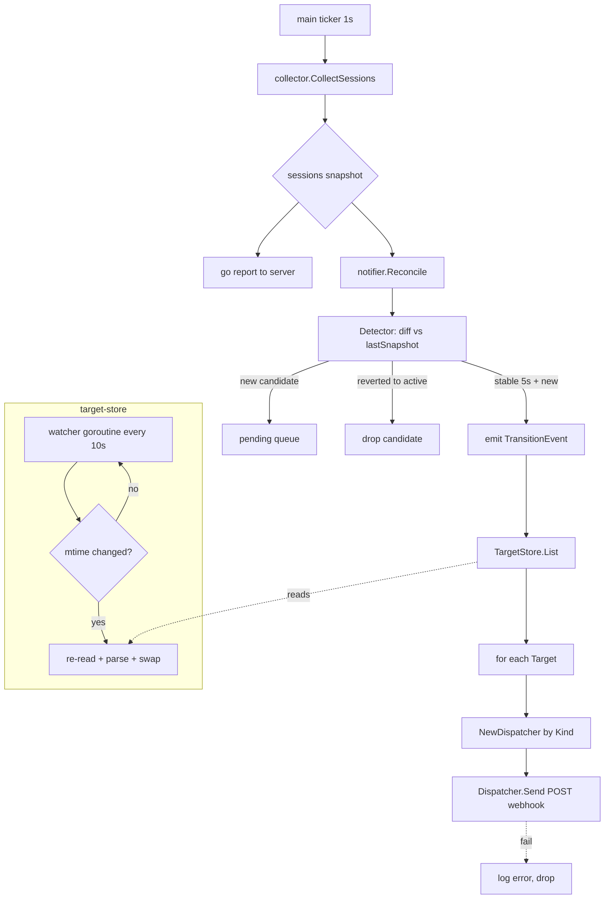
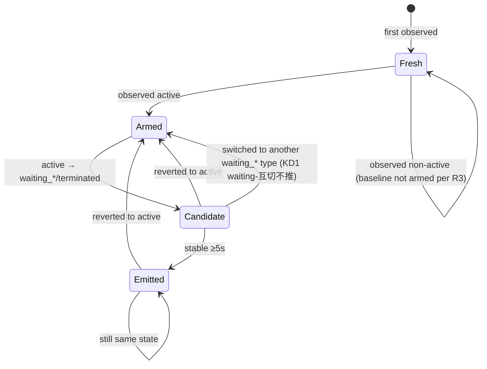
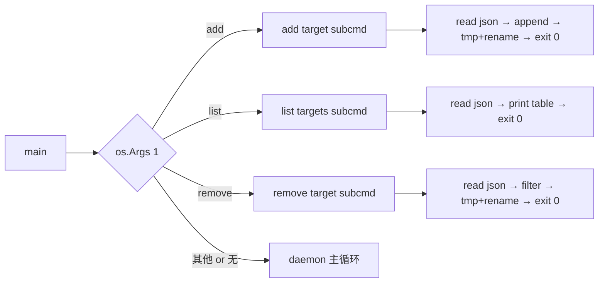

# Agent Notify Targets - Plan

## Goal Capsule

- **Objective:** 让 `coding-pet-agent` 在本机 session 从 `active` 跃迁到 `waiting_for_input` / `waiting_for_approval` / `terminated` 时，除了照常上报中心 server，还能主动推送短消息到用户配置的企业微信群机器人；结构上预留分发器接口，便于未来扩展到钉钉 / Slack / 自定义 webhook。
- **Product authority:** `ce-brainstorm` on 2026-07-10；requirements-only 版本，实现细节留给 `ce-plan`。
- **Product Contract preservation:** unchanged（`ce-plan` 未修改 R1–R22 与 Key Decisions；仅在下游 Planning Contract / Implementation Units 中细化如何落地）。
- **Open blockers:** 无。

---

## Product Contract

### Summary

给 `coding-pet-agent` 增加"本机主动通知"能力：采集到 session 从干活转为需要人参与（或已终止）时，agent 直接把 `机器名 / 工具+CWD / 新状态` 发到本地配置的一组 target webhook（MVP 仅企微群机器人）。新增 `agent add target` / `list targets` / `remove target` 子命令管理这组 target，配置持久化到 `~/.coding-pet/targets.json`，agent 进程周期性重读配置。整体保持前台进程 + fire-and-forget 风格，与现有 server 上报路径互不干扰。

### Problem Frame

当前 `coding-pet-agent` 采集到 session 状态后只上报中心 server；用户要靠手机浏览器主动打开仪表盘才能看到 "有会话在等你输入" 的提醒。仪表盘虽然会闪烁高亮，但前提是页面已经在前台。真实场景里：手机进入 Android 客户端的"伪熄屏时段"、屏幕不在眼前、用户切到别的应用做事时，等待往往拖上十几分钟才被发现——这抵消了整套仪表盘"避免 agent 干等"的核心价值。

需要一条 push 通道，让状态从"干活"变成"需要人参与"这一瞬间可以直接触达用户的即时通讯工具，不再依赖用户主动查看。企微机器人是 MVP 目标（用户日常已在企微），但同一个 push 能力对钉钉 / Slack / 自定义 webhook 也成立，所以接口上要预留扩展点。

推送逻辑必须放在 agent 侧而非 server 侧的原因：状态判定的完整语义已经在 agent 上（`internal/collector` 已经区分 `active` / `waiting_for_input` / `waiting_for_approval` / `terminated` / `unknown`，见 `internal/protocol/types.go`），server 收到的是聚合后的快照，且 agent 到 server 的上报本身可能延迟或丢包。让 agent 自己在采集回路里检测跃迁，最贴近数据源，也最容易保证"active → 非 active 那一刻"的时机准确性。

### Key Decisions

- **KD1. 触发规则采用单向阈值：仅在 `active → {waiting_for_input, waiting_for_approval, terminated}` 时推送。** waiting 之间互切（`waiting_for_input ↔ waiting_for_approval`）不推、反向 `waiting → active` 或 `terminated → active`（如果发生）不推。产品判断：通知是"叫你回来"的信号，用户回到会话后不需要再被"活了"打扰；waiting 类型之间的细分归类差异，用户看仪表盘就够。

- **KD2. 启动首采样若已处于 waiting/terminated 一律不推。** agent 必须先在自身生命周期内见到过一次 `active`，该 session 才建立"可推送基线"。理由：避免 agent 重启 / 首次部署时把机器上"存量等待中"的会话一次性刷屏。代价是 agent 重启期间新产生的等待会漏一次通知，可接受。

- **KD3. 防抖门槛 5 秒。** 新状态需在连续采样中稳定 ≥5 秒（配合 1 秒采集间隔即约 5 次采样）才触发推送。避免瞬时抖动 `active↔waiting↔active` 引发多余噪声。5 秒是经验默认值；配置化留给 `ce-plan` 判断是否值得暴露成 flag。

- **KD4. target 抽象带 `kind` 字段，MVP 仅实现 `wechat_work`。** 配置文件里每条 target 结构为 `{"kind": "wechat_work", "url": "..."}`；代码里定义 `Dispatcher` 接口，`wechatWorkDispatcher` 是唯一实现。未来加钉钉 / Slack / 自定义 webhook 只需实现新 Dispatcher 并按 `kind` 路由，配置文件格式向前兼容。

- **KD5. `agent add/list/remove target` 子命令写共享配置文件，不引入 IPC。** 配置文件 `~/.coding-pet/targets.json` 是 agent 进程与子命令的唯一交换点；agent 主循环周期性重读文件（建议 10 秒一次），发现内容变化即刷新内存中的 target 列表。理由：避免 Unix socket / 本地 HTTP 的跨平台复杂性（Windows daemon 化本身就是难题——见 KD6），子命令本质是"写一行 JSON 后退出"，无需在线通信。

- **KD6. agent 保持前台进程；后台化交给外部机制。** 不做进程 fork / detach / Windows Service，与现有 `restart.sh` + `nohup` 的部署风格一致。仅调整启动日志：启动时打印一次 "server=X, targets=[Y, Z]" 摘要后不再逐轮 `.` 刷屏；日常上报静默，只在错误 / target 变化 / 推送事件时写日志。

- **KD7. 推送失败 fire-and-forget，不重试、不持久化。** 单次 HTTP POST，失败写一行错误日志即丢弃。同一 session 后续再次发生 `active → waiting` 才有下一次通知机会。理由：通知类信息迟到即无价值；企微限流（20 条/分钟）与网络瞬断在实际频率下极少同时命中，工程复杂度不值得。

- **KD8. 推送路径与 server 上报路径完全独立。** 上报 server 与推送 target 是两条并行的 fire-and-forget 分支，任一失败不影响另一条。即使 target 列表为空，agent 仍照常上报 server；即使 server 不可达，target 推送仍照常工作。

### Requirements

**触发与防抖**

- R1. Agent 在每次采集完 session 后，需要检测每个 session 的状态是否从上一轮的 `active` 变成 `waiting_for_input` / `waiting_for_approval` / `terminated`；只有这三种正向跃迁触发推送候选。
- R2. 反向跃迁（`waiting_for_* → active`、`terminated → active`）以及 waiting 类型间的互切（`waiting_for_input ↔ waiting_for_approval`）不触发推送。
- R3. Agent 启动后首次采集时看到的 session，无论当时是什么状态，均不算作跃迁；必须先观察到一次 `active`，该 session 才建立后续推送的基线。
- R4. 触发候选需要在 ≥5 秒内连续采样保持同一个新状态才实际推送；期间若又切回 `active` 则该候选作废。

**消息内容**

- R5. 每次推送的消息文本格式为 `{机器名} / {工具} {CWD相对路径} / {新状态}`，例：`dev-01 / claude_code ~/work/coding-pet / waiting_for_input`。
- R6. 机器名取 agent 当前的 `hostname`（`--hostname` flag 或 `os.Hostname()`）。工具名沿用 `SessionTool` 常量的字符串值（`codebuddy` / `codebuddy_ide` / `workbuddy` / `claude_code`）。
- R7. CWD 若在用户 home 下则替换成 `~/` 缩写形式；否则保留绝对路径原样输出。
- R8. 状态字段沿用 `SessionState` 常量的字符串值（`waiting_for_input` / `waiting_for_approval` / `terminated`）；不做本地化翻译。

**Target 配置**

- R9. Target 列表持久化到 `~/.coding-pet/targets.json`，结构为 JSON 数组，每条元素形如 `{"kind": "wechat_work", "url": "<webhook-url>"}`。
- R10. 未来扩展新 `kind`（如 `dingtalk` / `slack` / `webhook_generic`）不需要迁移旧文件；`kind` 未知时 agent 写一行错误日志并跳过该条 target，不阻塞其他 target 工作。
- R11. Agent 主循环每 10 秒重读一次 `targets.json`；配置文件不存在或为空数组时视为"无 target"，agent 正常运行仅不推送。
- R12. 配置文件解析失败（JSON 语法错误等）时保留内存中当前的 target 列表继续工作，并写一行错误日志。

**子命令**

- R13. `agent add target <url> [--kind wechat_work]` 追加一条 target 到配置文件后退出；`--kind` 默认 `wechat_work`。同一 URL 已存在时视为 no-op 并提示。
- R14. `agent list targets` 打印当前配置文件里的所有 target，含序号、`kind`、`url`；配置文件不存在时打印空列表。
- R15. `agent remove target <url|序号>` 支持按完整 URL 或 `list` 输出的序号删除；删除后写回文件。序号 / URL 未匹配时以非零退出码报错。
- R16. 子命令与常驻 agent 进程可以并存运行；两侧都写配置文件时以最后一次成功写入为准（简单文件写入语义，MVP 不做锁）。

**分发**

- R17. Agent 内部定义 `Dispatcher` 接口，包含至少 `Kind() string` 与 `Send(msg string) error` 两个方法；`wechatWorkDispatcher` 是 MVP 唯一实现。
- R18. 每次推送对当前 target 列表逐个串行调用对应 Dispatcher；单个 target 失败只影响自身，不阻塞其他 target。
- R19. `wechatWorkDispatcher` 向 target 的 `url` POST 标准企微文本消息体 `{"msgtype":"text","text":{"content": "<message>"}}`，Content-Type: application/json，超时 10 秒。
- R20. 推送 HTTP 非 2xx 或超时/网络错误一律写一行错误日志（含 target 序号 / URL 前缀，避免完整 URL 泄漏到日志）后丢弃，不重试、不入队。

**启动与日志**

- R21. Agent 启动时打印一次配置摘要，形如 `server=http://... targets=[wechat_work://...abc, ...]`（URL 打印时截断保护），之后主循环不再逐轮打印 `.`。
- R22. Server 上报路径行为与现在完全一致；上报失败仍写日志，target 推送逻辑不能影响上报节奏。

### Actors

- A1. **本机开发者**：agent 部署者与消息接收者。通过命令行子命令管理 target，通过企微群接收状态通知。
- A2. **`coding-pet-agent` 主进程**：常驻前台进程，负责采集 + 上报 + 检测跃迁 + 推送。
- A3. **`coding-pet-agent` 子命令进程**：`add / list / remove target` 的短命进程，只读写配置文件后退出。
- A4. **企业微信群机器人**：接收 HTTP POST 的 webhook 端点，Dispatcher 的目标。
- A5. **中心 server**：现有 `coding-pet-server`，不受本特性影响，继续接收 agent 的常规上报。

### Key Flows

- F1. **正常推送**
  - **Trigger:** agent 主循环采到某 session 的新状态与上一轮内存快照不同，且跃迁方向命中 R1。
  - **Actors:** A2, A4
  - **Steps:** 采集器返回本轮 sessions → 状态机对比上一轮判断跃迁 → 跃迁进入"候选队列"（记录首次时间） → 5 秒后再次确认该 session 仍处该状态且未回到 `active` → 组装消息文本 → 遍历当前 target 列表，对每条调用对应 Dispatcher.Send → 无论成功失败继续下一条 → 记录本次推送到"最近推送快照"避免重复。
  - **Covered by:** R1, R4, R5, R17, R18, R19

- F2. **添加 target 并即时生效**
  - **Trigger:** 用户在同机执行 `agent add target <url>`。
  - **Actors:** A1, A3, A2
  - **Steps:** 子命令读取 `~/.coding-pet/targets.json` → 校验 URL 非空 → 若已存在则打印提示并 exit 0 → 否则 append 新条目并写回文件 → 打印新列表 → exit 0；主进程在下一次 10 秒重读周期内感知变化，日志打印 "targets updated: N -> M"。
  - **Covered by:** R11, R13, R16, R21

- F3. **启动首采样跳过存量**
  - **Trigger:** agent 冷启动后完成第一轮采集。
  - **Actors:** A2
  - **Steps:** 收集本轮 sessions → 对每个 session 记录其当前状态到内存快照，但不判定为"跃迁" → 下一轮开始才启用 R1 的跃迁检测；处于 waiting/terminated 的 session 需先见到 active 才能作为后续跃迁的起点。
  - **Covered by:** R3

- F4. **配置文件损坏时的降级**
  - **Trigger:** 主进程周期重读 `targets.json`，JSON 解析失败。
  - **Actors:** A2
  - **Steps:** 保留内存中当前的 target 列表 → 写错误日志（含错误摘要与文件路径） → 下一轮继续尝试重读，直到用户修好或删除文件。
  - **Covered by:** R11, R12

### Acceptance Examples

- AE1. **正向跃迁**
  - **Covers:** R1, R4, R5
  - **Given:** agent 已运行超过 10 秒，`~/work/coding-pet` 下有一个 `claude_code` session 处于 `active`；已配置一条企微 target。
  - **When:** 用户在 Claude Code 中触发一次 permission prompt，session 状态在下一轮采集变成 `waiting_for_approval`，并在之后 5 秒内保持。
  - **Then:** 企微群收到一条消息 `dev-01 / claude_code ~/work/coding-pet / waiting_for_approval`；agent 日志有一行 push 记录。

- AE2. **反向跃迁不推**
  - **Covers:** R2
  - **Given:** 上一场景之后，session 处于 `waiting_for_approval`。
  - **When:** 用户批准该 permission，session 状态回到 `active` 并稳定。
  - **Then:** 不发送任何企微消息；agent 日志无 push 记录。

- AE3. **抖动被防抖过滤**
  - **Covers:** R4
  - **Given:** agent 已运行，一个 `claude_code` session 处于 `active`。
  - **When:** 该 session 在 3 秒内由 active → waiting_for_input → active 反复抖动 2 次。
  - **Then:** 未达到 5 秒防抖门槛，不发送企微消息。

- AE4. **启动时不刷屏**
  - **Covers:** R3
  - **Given:** 本机已有 2 个 session 长时间处于 `waiting_for_input`，agent 尚未启动。
  - **When:** 启动 agent，首轮采集立即完成。
  - **Then:** 不发送任何企微消息；这两个 session 需在后续观察到一次 `active` 才建立推送基线。

- AE5. **add target 生效**
  - **Covers:** R11, R13
  - **Given:** agent 常驻运行中，`targets.json` 目前有 1 条 target。
  - **When:** 用户在同机执行 `agent add target https://qyapi.weixin.qq.com/cgi-bin/webhook/send?key=xxxx`。
  - **Then:** 子命令 exit 0 打印新列表；15 秒内 agent 主进程日志出现 "targets updated: 1 -> 2"；下一次跃迁两条 target 都收到消息。

- AE6. **推送单个 target 失败不影响其他**
  - **Covers:** R18, R20
  - **Given:** 配置了 2 条 target，其中第 1 条 URL 已失效。
  - **When:** 一次正向跃迁触发推送。
  - **Then:** 第 1 条日志出现错误行；第 2 条正常收到消息。

### Scope Boundaries

**Out of scope（本轮不做）**

- Windows 真 daemon / Windows Service 注册；agent 保持前台进程，后台化靠 systemd / nohup / Task Scheduler。
- IPC 通道（Unix socket、本地 HTTP、共享内存等）；子命令与主进程只通过 `targets.json` 交换。
- 跨重启的推送去重 / 消息队列持久化；重启即遗忘。
- 除企微以外的 Dispatcher 实现（钉钉 / Lark / Slack / 自定义 webhook）；结构预留但不实现。
- 反向跃迁通知（waiting → active 表示"活了"）。
- 消息内容自定义模板 / Markdown 格式 / 富文本 / @人。
- Server 侧统一分发（把推送逻辑上移到 server 集中处理）。
- 多机去重（同一 session 只由一台机器推送）。
- 推送频率限流 / 令牌桶。
- 配置文件写入并发锁；MVP 假设子命令调用不密集。

**Deferred for later（后续可能加）**

- 消息模板与 formatter 抽象，允许用户按 target 定义不同格式。
- 更多 Dispatcher（钉钉、Lark、Slack、Discord、通用 JSON webhook）。
- Target 分组 / 按 session 工具类型或 CWD 前缀路由到不同 target。

### Dependencies / Assumptions

- `SessionInfo.CWD` 字段已存在（`internal/protocol/types.go:38`）且被所有 collector 正确填充。
- 企微群机器人 webhook 接受标准文本消息体 `{"msgtype":"text","text":{"content":"..."}}`，无需额外鉴权。
- 单台 agent 上 target 数量在个位数（≤10）；串行 POST 不构成瓶颈。
- 用户 home 目录可写（`~/.coding-pet/` 由 agent 或子命令按需创建）。
- 现有 `internal/collector.Collector.CollectSessions()` 是幂等纯函数，每轮返回本机当前 session 快照，可作为跃迁检测的数据源。

### Sources / Research

- `cmd/agent/main.go:82-95` — 主循环结构，`report` 是 fire-and-forget goroutine。集成点：在 `report` 之后 / 之前加一个并行的 `notify` 分支，或在 `CollectSessions` 返回后先做跃迁检测再进入现有分支。
- `internal/protocol/types.go:1-47` — `SessionState` / `SessionTool` / `SessionInfo` 定义，直接决定消息拼装用的字段名与值。
- `internal/collector/collector.go` — 采集入口，跃迁检测的数据来源。
- `README.md` "状态判定" 部分 — 各工具状态语义的权威说明，`ce-plan` 阶段可作为消息内容措辞的参考依据。
- 企微群机器人 webhook 文档（外部）：`https://developer.work.weixin.qq.com/document/path/91770` — Dispatcher 实现细节留给 `ce-plan`。

### Outstanding Questions

**Deferred to Planning**

- 具体防抖时长的默认值（5 秒 vs 8 秒 vs 10 秒）与是否要暴露成 flag / 环境变量。
- 内存中"跃迁候选队列"与"最近推送快照"的具体数据结构（是否要限制大小、是否要 TTL 淘汰）。
- 子命令并发写文件时的原子性（是否值得用临时文件 + rename 的写法）。
- 日志中 URL 打印的截断规则（保留域名 + key 前 N 位 vs 完全打码 vs 只打印序号）。
- 状态跃迁的检测粒度：以 `SessionID` 为主键，还是 `(MachineID, Tool, CWD)` 组合键（后者对 session 重启有更好的连续性）。
- 与 `internal/selfupdate` 的交互：自更新重启后如何最小化对"启动首采样跳过存量"规则的影响。

---

## Planning Contract

### Assumptions

- 跃迁检测以 `SessionInfo.SessionID` 为主键。理由：`SessionID` 已是采集器返回的稳定标识，全链路下游都用它；R3 已经规定"session 重启视作新 session，需要再见一次 active 才建基线"，组合键的"重启连续性"优点在此语义下无收益。
- 防抖默认值 5 秒（`debounceWindow = 5 * time.Second`），不暴露 flag；`ce-plan` 判断当前无足够信号说明用户需要可调。
- 配置文件变化感知走每 10 秒 `os.Stat` 比 mtime + 内容 hash 的轮询；不引入 `fsnotify` 依赖。
- 子命令写文件采用"写临时文件 → `os.Rename`"的原子替换语义，避免子命令中途崩溃损坏 JSON；主进程读文件时先加 `sync.RWMutex` 锁内存缓存后再解析新内容。
- 单个 target HTTP POST 超时 10 秒，与 `cmd/agent/main.go:133` 现有 server 上报客户端一致。
- 日志中 URL 脱敏格式：`<kind>://<host><path前 20 字符>...key=<key 前 4 位>****`；无 `key=` 时只截取前 40 字符加 `...`。
- 跃迁候选队列和"最近推送快照"结构：`map[SessionID]entry`，`entry` 含 `firstSeenAt`、`newState`、`baselineArmed`（是否已见过 active）。session 从连续 60 秒采集结果消失即从 map 清除。
- 自更新重启视作 agent 重启：新进程的第一轮采样按 R3 走"启动首采样不推"，这是可接受的语义。
- 采集异常（`collector.CollectSessions()` 返回 nil / panic）时跃迁检测跳过这一轮，内存快照不更新，等下一轮再判。

### Product Contract preservation

R1–R22 与 KD1–KD8 内容原封不动。Requirements 里出现的 5 秒防抖、10 秒重读周期、10 秒 POST 超时在 Assumptions 中被显式实例化为默认值；这些是"细化"而非"变更"，与 brainstorm 的意图一致。

### Key Technical Decisions

- **KTD1. 跃迁检测放在 `cmd/agent/main.go` 主循环，不动 collector。** 在每轮 `c.CollectSessions()` 返回后新增一个 `notifier.Reconcile(sessions)` 调用，与 `report(...)` 并列（两条 fire-and-forget 分支）。`internal/collector` 的采集与状态判定语义（README 状态表）保持零改动，测试面收窄到"给定一串 SessionInfo 序列，输出正确的推送事件序列"。

- **KTD2. 新增 `internal/notifier` 包，承载跃迁状态机、target 管理、Dispatcher 分发。** 分为三层：`notifier.Detector`（无状态输入 sessions 快照，输出跃迁事件流）、`notifier.TargetStore`（读写 `~/.coding-pet/targets.json`，含内存缓存 + 定时重读）、`notifier.Dispatcher` interface（当前唯一实现 `wechatWorkDispatcher`）。三层通过 `notifier.Notifier` 组合，暴露 `Reconcile(sessions []SessionInfo)` 一个方法给 main。

- **KTD3. 子命令用轻量手写分派，不引 CLI 框架。** `cmd/agent/main.go` 顶部识别 `os.Args[1]`：`add`/`list`/`remove` 走子命令分支后 `os.Exit(0)`；其他情况（包括无参数）走原有 daemon 分支。子命令自己用 `flag.NewFlagSet` 解析剩余参数。理由：只有 3 个命令 + `agent target ...` 命名不深，标准库足够，不引入 cobra 增加编译体积和学习成本。

- **KTD4. 子命令写文件走"tmp + rename"原子替换。** `agent add/remove target` 先读现有 JSON、构造新数组、写到 `~/.coding-pet/targets.json.tmp`，然后 `os.Rename` 覆盖原文件。避免子命令进程中途被杀掉时文件半写坏。

- **KTD5. Dispatcher 接口最小化。** `type Dispatcher interface { Kind() string; Send(ctx context.Context, msg string) error }`。工厂函数 `NewDispatcher(target Target) (Dispatcher, error)` 按 `target.Kind` 路由；unknown kind 返回 error，Notifier 收到 error 记一行日志并跳过该 target。未来加 `dingtalk` / `slack_webhook` 只需追加一个实现 + 工厂 case。

- **KTD6. 配置文件重读机制。** `TargetStore` 内部一个 `sync.RWMutex` 保护 `targets []Target` 和 `lastMTime time.Time`。启动时同步读一次；随后独立 goroutine 每 10 秒 `os.Stat`，如果 `ModTime` 变化则重读、解析、原子替换内存副本。解析失败保留旧副本 + 写错误日志（R12）。

- **KTD7. 消息拼装在 Detector 输出事件时完成。** `TransitionEvent` 结构包含 `MachineID`、`Hostname`、`Tool`、`CWD`、`NewState`、`SessionID`（用于日志 / 去重），文本模板 `{hostname} / {tool} {cwd~} / {state}` 在 Detector 层格式化。CWD 里的 `$HOME` 前缀替换为 `~/`（`strings.HasPrefix + ReplaceAll` 一行），无 home 匹配时保留绝对路径原样（R7）。

- **KTD8. 启动日志新格式。** 现有 `Starting coding-pet-agent %s, machine_id=..., server=...` 行保留；随后再打一行 `notifier: N targets loaded`（含 kind 分布，例：`notifier: 2 targets loaded (wechat_work=2)`）；后续主循环删掉 `fmt.Printf(".")`。上报错误、target 变化、推送事件按需写完整 log 行。

### High-Level Technical Design

采集 → 跃迁检测 → 分发 的数据流：



Detector 状态机（每个 SessionID 独立）：



CLI 命令分派：



### Sources & Research

- `cmd/agent/main.go:23-95` — daemon 主循环与 `report` fire-and-forget 结构；`notifier.Reconcile` 插入点在 `for range ticker.C` 内、`go report(...)` 之前或之后。
- `cmd/agent/main.go:99-147` — HTTP 客户端超时 10 秒 + `Content-Type: application/json` 的现成模板，Dispatcher HTTP 调用照此复用。
- `internal/protocol/types.go:5-31` — `SessionState` / `SessionTool` 常量字符串值直接进消息文本，无需二次映射（R6, R8）。
- `internal/collector/collector.go:22-48` — `Collector.CollectSessions()` 幂等纯函数假设成立（Assumptions 依据）。
- `internal/applog/applog.go:18-35` — 日志写到 `<exeDir>/coding-pet-agent.log`；notifier 直接用 `log` 包即可继承。
- `internal/selfupdate/` 包结构与 `cmd/agent/main.go:41-48` — 自更新重启后主进程从 flag 解析开始重跑，视作 agent 冷启动。
- 企微群机器人 webhook 文档（外部）：`https://developer.work.weixin.qq.com/document/path/91770` — 请求体 `{"msgtype":"text","text":{"content":"..."}}`。

### Scope Boundaries

**Deferred to Follow-Up Work**（本 plan 不做，但认可为后续 backlog）

- Dispatcher 的钉钉 / Lark / Slack / 通用 JSON webhook 实现（KD4 已预留接口）。
- 消息模板 / formatter 抽象与自定义。
- Target 按 session 工具类型或 CWD 前缀路由。
- 多机去重（一个 session 只由一台机器推送）。
- 跨重启的推送去重 / 消息队列持久化。
- 推送频率限流 / 令牌桶。

**Outside this product's identity**（brainstorm 层面明确不做，不在追赶列表）

- Windows 真 daemon / Windows Service。
- IPC 通道（Unix socket / 本地 HTTP）。
- 反向跃迁通知（waiting → active）。
- Server 侧统一分发。

### Open Questions

无——所有 brainstorm 时期的"Deferred to Planning"问题都已在 Assumptions / KTDs 中给了默认值。实施过程中若发现 Assumptions 假设与实际不符（例：collector 并非幂等纯函数），在实现单元内标记出并回来更新此节。

---

## Implementation Units

### U1. 定义 notifier 包骨架与数据结构

**Goal:** 建立 `internal/notifier` 包的类型定义与目录，把跃迁检测、Target 管理、Dispatcher 分派三层的接口固化下来，后续单元填充实现。

**Requirements:** 支撑 R1、R5、R9、R10、R17。

**Dependencies:** 无。

**Files:**
- `internal/notifier/notifier.go` — 新建。包注释 + 顶层 `Notifier` 组合器 struct + `Reconcile(sessions []protocol.SessionInfo)` 入口方法（暂 stub）。
- `internal/notifier/target.go` — 新建。`Target` struct（`Kind`, `URL`），`TargetStore` interface + `fileTargetStore` struct（字段先定，方法后续单元填）。
- `internal/notifier/detector.go` — 新建。`Detector` struct、`sessionEntry` 内部结构（`baselineArmed bool`, `candidateState protocol.SessionState`, `candidateFirstSeen time.Time`, `lastSeen time.Time`）、`TransitionEvent` struct（`Hostname`, `Tool`, `CWD`, `NewState`, `SessionID`）。
- `internal/notifier/dispatcher.go` — 新建。`Dispatcher` interface（`Kind() string`, `Send(ctx context.Context, msg string) error`），`NewDispatcher(t Target) (Dispatcher, error)` 工厂签名。
- `internal/notifier/notifier_test.go` — 新建，先放一个占位测试确认包能编译。

**Approach:**
- 只写类型与方法签名，不写业务逻辑。所有方法可以先 `panic("not implemented")` 或 `return nil`。
- 包内 import 已存在的 `internal/protocol` 提供 `SessionInfo` / `SessionState` / `SessionTool`。
- 严禁跨包泄漏 `protocol` 类型给外部：`TransitionEvent` 里 `Tool` / `NewState` 用 `string`（在 Detector 内转字符串），避免 dispatcher 层出现 protocol 依赖。

**Patterns to follow:**
- 遵循仓库现有小包风格：`internal/applog`（单 go 文件 + 明确注释）、`internal/selfupdate`（多 go 文件 + 内部私有 struct）。

**Test scenarios:**
- 单元测：`TestNotifier_Compiles`——构造 `&Notifier{}` 与 `NewDispatcher(Target{Kind: "wechat_work", URL: "http://x"})`，断言不 panic、返回值非 nil。骨架期只保证包结构正确。

**Verification:**
- `go build ./...` 通过；`go vet ./internal/notifier` 无告警；`go test ./internal/notifier/...` 通过（只有占位测试）。

---

### U2. 实现 Detector：跃迁检测 + 防抖 + 启动首采样跳过

**Goal:** 让 `Detector.Reconcile(sessions []SessionInfo) []TransitionEvent` 按 KD1/KD2/KD3、R1–R4 的语义输出跃迁事件。

**Requirements:** R1, R2, R3, R4；间接 R5–R8（消息文本生成）。

**Dependencies:** U1。

**Files:**
- `internal/notifier/detector.go` — 填充 `Reconcile` 与 `sessionEntry` 状态转移逻辑。
- `internal/notifier/detector_test.go` — 新建。表驱动测试覆盖状态机所有分支。

**Approach:**
- `Detector` 内部持有 `map[string]*sessionEntry`（key = `SessionID`）与 `sync.Mutex`（`Reconcile` 由主循环单 goroutine 调用，锁其实用于将来 exposed API，暂加为防御）。
- `Reconcile` 内一次遍历本轮 sessions：
  1. 若 map 无此 SessionID → 新建 entry，`baselineArmed = (state == active)`。仅这样"启动首采样"就自动落到 R3：初见非 active 的会话 `baselineArmed=false`，需后续见到一次 active 才置 true。
  2. 已存在 entry：先按新旧 state 判定跃迁类型（详见状态机图），维护 `candidateState` / `candidateFirstSeen`；若 candidate 稳定 ≥ `debounceWindow`（默认 5s，包级 const）则生成 `TransitionEvent` 并把 candidate 置空、更新 lastSeen；若回到 active 则清空 candidate、`baselineArmed=true`。
  3. 更新 entry.lastSeen。
- 单独一轮清理：遍历 map，`time.Since(entry.lastSeen) > 60s` 的删除。
- 消息文本 `FormatMessage(evt TransitionEvent) string` 独立小函数：`{hostname} / {tool} {cwdReplaceHome} / {state}`；`cwdReplaceHome` 若 `strings.HasPrefix(cwd, home+"/")` 则替换成 `~/...`，否则原样。`os.UserHomeDir()` 失败视作无 home 直接原样返回。
- Detector 构造函数注入 `now func() time.Time`（默认 `time.Now`），方便测试打时钟。

**Patterns to follow:**
- 表驱动测试：参考 `internal/collector/logstate_test.go`。
- 时钟注入：Go 常用做法，函数值参数比 interface 简单。

**Test scenarios:**
- Covers AE1. `TestDetector_ActiveToWaitingForApproval_EmitsAfterDebounce`: 序列 [t=0 active, t=1 waiting_for_approval, t=6 waiting_for_approval] → 第二轮无事件，第三轮输出一条 event。
- Covers AE2. `TestDetector_WaitingBackToActive_NoEmit`: 序列 [t=0 active, t=1 waiting_for_input, t=6 waiting_for_input (emit), t=7 active] → 只在 t=6 输出一次，t=7 不输出。
- Covers AE3. `TestDetector_JitterDebounced`: 序列 [t=0 active, t=1 waiting_for_input, t=3 active, t=4 waiting_for_input, t=8 waiting_for_input] → 第 4 轮不 emit（防抖计时器重置），第 5 轮距 t=4 已过 5s，emit 一次。
- Covers AE4. `TestDetector_StartupExistingWaitingNotEmitted`: 序列 [t=0 waiting_for_input, t=5 waiting_for_input, t=10 waiting_for_input] → 全程不输出（baseline 未 arm）。
- `TestDetector_WaitingInputToApproval_NoEmit`: 序列 [active → waiting_for_input (emit) → waiting_for_approval 稳定 5s] → 只有第一次 emit，waiting 互切不推（KD1）。
- `TestDetector_TerminatedTriggersEmit`: 序列 [active, terminated 稳定 5s] → emit 一条 `state=terminated`。
- `TestFormatMessage_HomeReplacement`: 给定 `Hostname=dev-01`, `Tool=claude_code`, `CWD=$HOME/work/coding-pet`, `NewState=waiting_for_input` → 输出 `dev-01 / claude_code ~/work/coding-pet / waiting_for_input`。
- `TestFormatMessage_NonHomePath`: CWD `/opt/foo` → 原样保留。
- `TestDetector_SessionDisappears_EntryPurged`: session 从采集结果消失 61s 后再回来，视作新 session（`baselineArmed=false`）。

**Verification:**
- `go test ./internal/notifier -run TestDetector -v` 全部通过；`go test -race ./internal/notifier` 无 race。

---

### U3. 实现 fileTargetStore：读、原子写、周期重读

**Goal:** 支撑 `~/.coding-pet/targets.json` 的持久化与主进程侧的定时重读。

**Requirements:** R9, R10, R11, R12, R16。

**Dependencies:** U1。

**Files:**
- `internal/notifier/target.go` — 填充 `fileTargetStore`：`Load()`, `List() []Target`, `Add(Target) error`, `Remove(key string) error`（`key` 可为 URL 或 1-based 序号）, `startWatch(ctx context.Context, interval time.Duration)`。
- `internal/notifier/target_test.go` — 新建。使用 `t.TempDir()` 隔离配置文件路径。

**Approach:**
- `fileTargetStore` 字段：`path string`, `mu sync.RWMutex`, `cached []Target`, `lastMTime time.Time`, `lastHash [32]byte`（`sha256` of file bytes，防止 mtime 抖动但内容未变）。
- `resolveConfigPath()` helper：优先取 `$CODING_PET_TARGETS_PATH`（测试可覆盖），否则 `filepath.Join(os.UserHomeDir(), ".coding-pet", "targets.json")`；`os.MkdirAll(filepath.Dir(path), 0o700)` 确保目录存在。
- `Load()`：读文件；不存在→cached 置空数组不报错；解析失败→保留旧 cached + 返回 error（调用者写日志）。
- `Add/Remove`：Load → 修改 slice → `writeAtomic(path, bytes)`：写到 `path + ".tmp"`（0o600 权限） → `os.Rename`。
- `startWatch`：goroutine 内 `time.NewTicker(interval)`，每 tick 调 `Load()` 并对比 `lastHash`；变化则替换 cached 并 log 一行 `targets updated: N -> M`。ctx cancel 退出。
- 未知 `Kind`：`Load()` 时保留在 cached 中不过滤（让 Dispatcher 分发时报错 + 跳过，符合 R10 语义）。

**Patterns to follow:**
- 权限：仓库现有对 home 目录文件的默认写法（简单 0o644/0o600 无统一约定），target 涉及 webhook secret 用 0o600。
- 测试用 tempdir：`internal/collector/codebuddy_ide_test.go` 有 `t.TempDir()` 用例可参考。

**Test scenarios:**
- Covers AE5. `TestTargetStore_AddThenList`: Add 一条 → List 返回该条；再 Add 同一 URL → List 仍只有一条（幂等，R13）。
- `TestTargetStore_LoadMissingFile`: 文件不存在 → `List() == []`, `Load()` 不报错。
- `TestTargetStore_LoadCorruptFile`: 文件内容非法 JSON → Load 返回 error；cached 保留上一次成功的内容（R12）。
- `TestTargetStore_RemoveByURL`: 加 2 条，按完整 URL 删中间那条 → List 返回剩下 1 条。
- `TestTargetStore_RemoveByIndex`: 加 2 条，按 `"1"` 序号删 → 剩下第 2 条。
- `TestTargetStore_RemoveNotFound`: 不存在的 URL / 越界序号 → 返回 error，文件内容不变。
- `TestTargetStore_AtomicWrite`: 手动往 `path.tmp` 写乱数据后调 `Add` → 最终 `path` 内容有效且 `.tmp` 已被 rename 覆盖或删除，`path` 不残留半写状态。
- `TestTargetStore_WatchReloadsOnChange`: 起 `startWatch(50ms)`，测试线程直接写文件；100–200ms 内 `List()` 观察到新内容。
- `TestTargetStore_WatchIgnoresIdenticalContent`: 用 `os.Chtimes` 只改 mtime 内容不变；hash 相同不触发 log。
- `TestTargetStore_UnknownKindPreserved`: 文件里含 `{"kind":"dingtalk","url":"..."}` → Load 返回全部 target，未知 kind 不过滤。

**Verification:**
- `go test ./internal/notifier -run TestTargetStore -v` 全部通过；`go test -race ./internal/notifier` 无 race（watch goroutine 与 test 线程并发访问 cached）。

---

### U4. 实现 wechatWorkDispatcher 与 Dispatcher 工厂

**Goal:** 完成 `NewDispatcher` 工厂 + 唯一实现 `wechatWorkDispatcher.Send`。

**Requirements:** R17, R19, R20（脱敏日志由 U6 完成）。

**Dependencies:** U1。

**Files:**
- `internal/notifier/dispatcher.go` — 填充 `wechatWorkDispatcher{url string, client *http.Client}` 与 `Send`。
- `internal/notifier/dispatcher_test.go` — 新建。用 `httptest.NewServer` 打桩企微端点。

**Approach:**
- `Send(ctx, msg)`：构造 `{"msgtype":"text","text":{"content": msg}}`；`http.NewRequestWithContext(ctx, POST, url, body)`；`Content-Type: application/json`；`client.Timeout = 10 * time.Second`；HTTP 状态非 2xx → 返回 error `wechat_work: HTTP <code>`；网络错误直接冒泡。
- `NewDispatcher(t Target)`：`switch t.Kind { case "wechat_work": ...; default: return nil, fmt.Errorf("notifier: unknown target kind %q", t.Kind) }`。
- 每次 Send 新建 request 不复用 body reader；HTTP client 可复用同一个（`http.Client{Timeout: 10s}`），Dispatcher 构造时注入。

**Patterns to follow:**
- HTTP 客户端超时值 10s 与 `cmd/agent/main.go:133` 一致。
- 测试用 `httptest.NewServer`：Go 标准库常见用法，仓库暂无先例但无学习成本。

**Test scenarios:**
- `TestWechatDispatcher_Success`: httptest server 返回 200 + `{"errcode":0}` → Send 无 error；断言收到的 request body JSON 结构正确、`msgtype=text`、`text.content` 与入参一致。
- `TestWechatDispatcher_Non2xx`: server 返回 500 → Send 返回 error 含 `HTTP 500`。
- `TestWechatDispatcher_Timeout`: server handler `time.Sleep(11s)` 后返回；给 dispatcher 注入 `client.Timeout=100ms`（测试快跑用） → Send 返回 error（`context deadline exceeded` 或类似）。
- `TestNewDispatcher_UnknownKind`: `NewDispatcher(Target{Kind: "dingtalk", URL: "..."})` → 返回 error 含 `unknown target kind`。
- `TestNewDispatcher_WechatWork`: `Kind=wechat_work` → 返回 `Dispatcher` 且 `d.Kind() == "wechat_work"`。

**Verification:**
- `go test ./internal/notifier -run TestWechatDispatcher -v -race` 全部通过。

---

### U5. 组装 Notifier：串联 Detector / TargetStore / Dispatcher

**Goal:** 让 `notifier.Notifier.Reconcile(sessions)` 拉通所有子模块，每条 TransitionEvent 遍历 target 分发；单 target 失败不影响其他。

**Requirements:** R18, R21（启动日志摘要归 U7）, R22（推送与 server 上报独立由 U7 保证）。

**Dependencies:** U2, U3, U4。

**Files:**
- `internal/notifier/notifier.go` — 填充 `Notifier` 组合器：字段 `detector *Detector`, `store TargetStore`, `newDispatcher func(Target) (Dispatcher, error)`；构造函数 `NewNotifier(hostname string, store TargetStore) *Notifier`（内部调 `NewDetector(hostname)`）；`Reconcile(sessions)` 方法。
- `internal/notifier/notifier_test.go` — 扩展。用 fake TargetStore + fake Dispatcher 覆盖分发逻辑。

**Approach:**
- `Reconcile(sessions)`：
  1. `events := n.detector.Reconcile(sessions)`。
  2. `targets := n.store.List()`。
  3. 若 `len(targets) == 0` → 返回（events 生成但无处发，Detector 已更新内存状态，下次会重新算——但根据 R3/R4 语义只 emit 一次，这里必须消耗掉否则会漏发。所以：无 targets 时也把 event 视为"已发",log 一行 `notifier: N events dropped (no targets)`）。
  4. 对每个 event × 每个 target：`disp, err := n.newDispatcher(t)`；err 非空 → log 跳过；否则 `disp.Send(ctx, FormatMessage(event))`；err 非空 → log 脱敏 URL + 错误消息，继续下一 target。
  5. 每个 target 用 10s 超时的 context.WithTimeout。串行不并发（假设 targets ≤ 10）。
- Reconcile 从 main 的采集 goroutine 直接调，非 fire-and-forget（推送本身内嵌超时；串行 10 个 target × 10s 最坏 100s，实际远小于此，可接受阻塞下一轮采集——采集间隔 1s，短暂 lag 无碍。若担心可以让 main 用 `go n.Reconcile(sessions)`，但要求 Detector 内部 mutex 保护）。
- **决策**：main 侧用 `go n.Reconcile(sessions)`（与 `report` 对称，fire-and-forget），Detector 内部 mu 已有保护。

**Test scenarios:**
- `TestNotifier_EventFansOutToAllTargets`: fake store 里 2 个 target，触发一次跃迁 → fake dispatcher 收到 2 次 Send 调用（每 target 一次），消息文本相同。
- Covers AE6. `TestNotifier_OneTargetFails_OthersReceive`: fake dispatcher for target 1 返回 error，target 2 正常 → 主流程完成，target 2 收到消息，error 被记录（用 test hook 观察 log 或用 fake logger）。
- `TestNotifier_UnknownKind_LoggedSkipped`: store 里含 `Kind=dingtalk` → newDispatcher 返回 error → 该 target 被跳过，其他 wechat_work target 正常。
- `TestNotifier_NoTargets_EventsSilenced`: store 空 → 触发跃迁 → 无 dispatcher 被调用，log 出现 dropped 记录。
- `TestNotifier_NoEvents_NoDispatch`: sessions 无变化 → dispatcher 零调用。

**Verification:**
- `go test ./internal/notifier -run TestNotifier -v -race` 通过。

---

### U6. 日志脱敏 URL 与推送记录

**Goal:** 让 log 输出既能定位到具体 target，又不泄漏完整 webhook secret。

**Requirements:** R20；辅助 R13/R14/R15 中的 URL 打印。

**Dependencies:** U3, U4, U5。

**Files:**
- `internal/notifier/redact.go` — 新建。`func RedactURL(kind, url string) string`。
- `internal/notifier/redact_test.go` — 新建。
- `internal/notifier/notifier.go` — 修改 log 语句用 `RedactURL(t.Kind, t.URL)`；push 事件成功也 log 一行 `notify sent [<kind>://<redacted>] session=<id-8> state=<new-state>`。

**Approach:**
- 规则（KTD7 收敛）：
  - 若 URL 含 `key=` query 参数：保留 `<scheme>://<host><path>?key=<key前4位>****`。
  - 若无 `key=`：`<scheme>://<host><前40字符路径>...`（截断）。
  - 若 URL 无法解析（`url.Parse` 报错）：`<invalid-url>`。
- 输出格式：`wechat_work://qyapi.weixin.qq.com/cgi-bin/webhook/send?key=abcd****`。
- 成功推送与失败推送均用同一函数生成"target 指纹"，避免两处代码不同步。

**Test scenarios:**
- `TestRedactURL_WithKey`: 输入 `https://qyapi.weixin.qq.com/cgi-bin/webhook/send?key=abcdef1234-verylong-secret` → 输出保留前 4 位 + `****`，不含后续 secret。
- `TestRedactURL_NoKey`: 输入 `https://example.com/hooks/abcdefghijklmnopqrstuvwxyz1234567890extra` → 输出路径截断至 40 字符 + `...`。
- `TestRedactURL_InvalidURL`: 输入 `ht!tp://%%%` → 输出 `<invalid-url>`。
- `TestRedactURL_MultipleParams`: 输入含 `key=xxx&extra=yyy` → 保留 key 前 4 位，其他 query 保留原样或整体截断（选定后写死断言）。

**Verification:**
- `go test ./internal/notifier -run TestRedactURL -v` 通过。
- 人工核查：本地手改 `notifier.go` 里的 log 语句后跑一次 U9 集成测，检查 log 输出不含完整 URL secret。

---

### U7. 集成到 `cmd/agent/main.go`：daemon 模式

**Goal:** 让常驻 agent 进程加载 targets、启动 watch、每轮采集后 fire-and-forget 调用 notifier。启动日志按 R21 改。

**Requirements:** R11 (watch), R21, R22。

**Dependencies:** U5, U6。

**Files:**
- `cmd/agent/main.go` — 修改 `main()`：
  - 在 `applog.Setup("agent")` 之后、`c := collector.New()` 之前，初始化 `notifier`。
  - 修改启动 log：现有 `Starting coding-pet-agent %s, machine_id=..., server=...` 保留；追加一行 `notifier: N targets loaded (wechat_work=N)`。
  - `for range ticker.C` 内追加 `go notifier.Reconcile(sessions)`（与 `go report(...)` 并列）——需要把采集结果先算好共享给两条分支。
  - 首轮 `report(...)` 之后同样调一次 `notifier.Reconcile`。
  - 删除 `fmt.Printf(".")`。

**Approach:**
- 采集重构：`sessions := c.CollectSessions()` 显式命名；然后：
  ```
  go report(sessions, serverURL, token, machineID, hostname)
  go notifier.Reconcile(sessions)
  ```
  `report` 签名从 `report(c *Collector, ...)` 改成 `report(sessions []SessionInfo, ...)`——避免两个 goroutine 并发调 `c.CollectSessions()`（当前代码是 `go report(c, ...)` 内部调，本轮改后可以共享一次采集结果）。
- notifier 初始化：`store := notifier.NewFileTargetStore("")`（空字符串走默认路径）；`store.Load()` 报错只打 log 不 fatal；`ctx, cancel := context.WithCancel(context.Background()); defer cancel()`；`go store.StartWatch(ctx, 10*time.Second)`；`nt := notifier.NewNotifier(actualHostname, store)`。
- 启动日志：`log.Printf("notifier: %d targets loaded (%s)", len(store.List()), summarizeKinds(store.List()))`；`summarizeKinds` 拼 `wechat_work=2,dingtalk=1`（未知 kind 也计数）。
- **切勿在此单元实现子命令**——子命令留给 U8。

**Patterns to follow:**
- `for range ticker.C` 内 `go` 分支 fire-and-forget：与现有 `report` 一致。
- 上下文取消：主进程无 SIGTERM 优雅退出机制（cmd/agent/main.go 现状），watch goroutine 生命周期与进程一致，`context.Background()` + `defer cancel()` 是象征性的（`for range ticker.C` 永不返回）；保留 defer 以便未来加优雅退出时不用重构。

**Test scenarios:**
- `TestReportShareSessionsSnapshot`（`cmd/agent` 下新建 `main_test.go`）：单元测重构后的 `report(sessions, ...)` 函数签名，用 httptest server 断言 POST body 里的 sessions 与传入切片对应。
- 集成测（`internal/notifier/integration_test.go` 或 `cmd/agent/integration_test.go`）：不直接测 main 函数（Go 主函数难测），而是构造 `Notifier + FakeStore + httptest.Dispatcher`，直接串联 3 个 Reconcile tick 断言端到端触发。
- 手工验收：本地 `go build ./cmd/agent && ./coding-pet-agent --server http://localhost:9999` 观察启动日志包含新 `notifier: 0 targets loaded ()` 行且后续无 `.` 刷屏。

**Verification:**
- `go build ./...` 成功；`./coding-pet-agent --version` 打印 `dev` 不 panic；本地 dry-run 启动 30 秒观察日志格式。

---

### U8. 实现 `agent add/list/remove target` 子命令

**Goal:** 支持 CLI target 管理三件套；与 daemon 模式并存。

**Requirements:** R13, R14, R15, R16。

**Dependencies:** U3。

**Files:**
- `cmd/agent/main.go` — 在 `flag.Parse()` 之前插入子命令分派逻辑。
- `cmd/agent/targets_cmd.go` — 新建。承载 `runAddTarget(args []string) int` / `runListTargets(args []string) int` / `runRemoveTarget(args []string) int`。
- `cmd/agent/targets_cmd_test.go` — 新建。

**Approach:**
- 分派逻辑（在 `main()` 的 flag 解析之前）：
  ```
  if len(os.Args) >= 3 && os.Args[1] == "add" && os.Args[2] == "target" {
      os.Exit(runAddTarget(os.Args[3:]))
  }
  ```
  同理 `list targets`、`remove target`。三件套外的所有情况（包括无参、单独 `add`、`--flag` 开头等）继续走原有 daemon 分支。
- 每个子命令内部：
  - 用 `flag.NewFlagSet(...)` 解析剩余参数。
  - `add`：位置参数 URL 必需，`--kind` optional 默认 `wechat_work`；调 `notifier.NewFileTargetStore("").Add(...)`；已存在 URL 打印 `target already exists: <redacted>` exit 0；成功 stderr 打印新 list、exit 0。
  - `list`：无参数；调 `.Load()` + `.List()`；按 `1) wechat_work <redacted>` 格式打印到 stdout；空列表打印 `(no targets)`；exit 0。
  - `remove`：位置参数 `<url-or-index>` 必需；命中 → 写回 → 打印新 list、exit 0；未命中 → stderr 打印错误、exit 1。
- 子命令不调 `applog.Setup`（不需要写日志文件，直接用默认 stderr）。
- 使用与 daemon 相同的 `resolveConfigPath`，环境变量 `$CODING_PET_TARGETS_PATH` 生效以便测试。

**Patterns to follow:**
- `flag.NewFlagSet(name, flag.ExitOnError)`：Go 标准子命令做法。
- 子命令测试：exec 自己（`exec.Command(os.Args[0], "add", "target", ...)`）；Go 常见测试模式 `TestMain + os.Getenv("BE_CHILD")` 判断。可选简化：直接调 `runAddTarget([]string{...})` 单元测，不走 exec。

**Test scenarios:**
- Covers AE5. `TestRunAddTarget_NewURL_AppendsAndPrints`: tempdir `$CODING_PET_TARGETS_PATH`；调 `runAddTarget([]string{"https://foo/webhook?key=aaaa1111"})` → 返回 0；文件包含 1 条。
- `TestRunAddTarget_DuplicateURL_NoOp`: 已加过一次；再加 → 返回 0，文件仍 1 条。
- `TestRunAddTarget_MissingURL_Error`: 参数空 → 返回非 0，stderr 有 usage。
- `TestRunAddTarget_CustomKind`: `--kind dingtalk https://...` → 文件条目 `kind=dingtalk`。
- `TestRunListTargets_Empty`: 无配置文件 → stdout 含 `(no targets)`，返回 0。
- `TestRunListTargets_TwoEntries`: 两条 target → stdout 分行、含 kind 与脱敏 URL。
- `TestRunRemoveTarget_ByIndex`: 加 2 条，`runRemoveTarget([]string{"1"})` → 剩 1 条。
- `TestRunRemoveTarget_ByURL`: `runRemoveTarget([]string{"https://foo/webhook?key=..."})` → 匹配成功。
- `TestRunRemoveTarget_NotFound`: `"999"` / 不存在的 URL → 返回非 0，文件不变。
- `TestSubcommandDispatch_ArgvOrdering`: build agent 二进制 + exec `agent add target https://x` → 子进程退出码 0；exec `agent` 无参 → 进入 daemon 分支（会因缺 --server 而 fatal，用 `--server http://localhost:1` 快速验证仍会尝试 report）。

**Verification:**
- `go test ./cmd/agent -run TestRun -v` 通过；`go test ./cmd/agent -run TestSubcommandDispatch -v` 通过。

---

### U9. 端到端手工烟测

**Goal:** 真实跑一遍 daemon + 子命令 + 企微 mock，确认 R1、R5、R11、R13、AE1–AE6 全部符合。

**Requirements:** 全体 R；核心是 AE1、AE5、AE6。

**Dependencies:** U7, U8。

**Files:**
- `scripts/notifier-smoke.sh` — 新建。可选：一个 bash 脚本编排 mock 企微 server + 启动 agent + 触发状态变更。若脚本化成本高，改成手工步骤放到 README。
- `README.md` — 在"部署"一节加一段"配置企微推送"说明（`agent add target ...` 用法）。

**Execution note:** 这是最后的 smoke 验证，非单元测能覆盖。手工执行，观察行为。

**Approach:**
- 起一个 mock webhook：`python3 -m http.server 9998` + 简易 handler 或 `netcat`；或写一个 tiny Go 单文件 `scripts/mock-webhook.go`。
- `./coding-pet-agent add target http://localhost:9998/`。
- `./coding-pet-agent list targets` 观察脱敏输出。
- `./coding-pet-agent --server http://localhost:3000 --token test`（另一 shell 起 server 或不起亦可，report 失败无关本 smoke）。
- 触发一个 claude_code session 从 active 变 waiting（真机操作）：在被监控的 CWD 里运行一个 Claude Code 并制造 permission prompt。
- 观察：mock 端收到 POST，body content `dev-XX / claude_code ~/... / waiting_for_approval`；agent log 出现 `notify sent [wechat_work://.../key=xxxx****]`。
- 校验 AE4：先把 claude_code 停在 waiting 状态，然后重启 agent，观察 5 秒内不发通知；再让 claude_code 回到 active，再切 waiting，此时 5s 后应通知。
- 校验 AE6：加第二条 target 指向 `http://localhost:1/`（unreachable）；触发跃迁；确认 target 1 收到消息、target 2 只写 log。

**Test scenarios:**
- 手工检查项列成 checklist（放 script comment 或 README 附录）。

**Verification:**
- 所有 checklist 项目通过；`docs/solutions/` 视情决定是否记录一条学习点（例如"5 秒防抖对 claude_code permission prompt 感觉如何"）。

---

## Verification Contract

| Gate | Command / Signal | Unit coverage |
|---|---|---|
| 编译 | `go build ./...` 成功 | U1–U8 |
| 静态检查 | `go vet ./...` 无输出 | U1–U8 |
| 单元测 | `go test ./internal/notifier ./cmd/agent -race -count=1` 全绿 | U1–U8 |
| Detector 状态机 | `go test ./internal/notifier -run TestDetector -v` | U2 |
| TargetStore 持久化 | `go test ./internal/notifier -run TestTargetStore -v` | U3 |
| Dispatcher HTTP | `go test ./internal/notifier -run TestWechatDispatcher -v` | U4 |
| Notifier 集成 | `go test ./internal/notifier -run TestNotifier -v` | U5 |
| 日志脱敏 | `go test ./internal/notifier -run TestRedactURL -v` | U6 |
| 子命令 | `go test ./cmd/agent -run TestRun -v` | U8 |
| 端到端 smoke | 手工按 U9 checklist 通过 | U9 |
| 现有测试无回归 | `go test ./... -race -count=1` 全绿 | ALL |

---

## Definition of Done

- 所有 22 条 Requirements 都有对应的单元测试或 U9 手工验收项覆盖，且 Verification Contract 表内命令全部通过。
- 6 条 Acceptance Examples（AE1–AE6）在测试代码里通过 `Covers AE<N>.` 注释显式关联，且相应测试通过。
- `coding-pet-agent` 二进制在无 `~/.coding-pet/targets.json` 的机器上启动仍正常上报（R11、R22 兼容退化）。
- `agent add target <url>` 后 15 秒内 daemon 主进程 log 出现 `targets updated: N -> M`，无需重启。
- `agent list targets` 输出脱敏 URL；对同一条完整 URL 执行 `agent remove target <url>` 能命中并删除。
- 日志文件 `coding-pet-agent.log` 中不含完整 webhook secret（人工 grep `key=[a-f0-9]{8,}` 应无匹配）。
- 启动日志包含 `notifier: N targets loaded (...)` 行；主循环不再输出 `.` 刷屏。
- U9 smoke 的 6 项 checklist 全部实测通过。
- README 部署章节包含企微推送配置示例。
